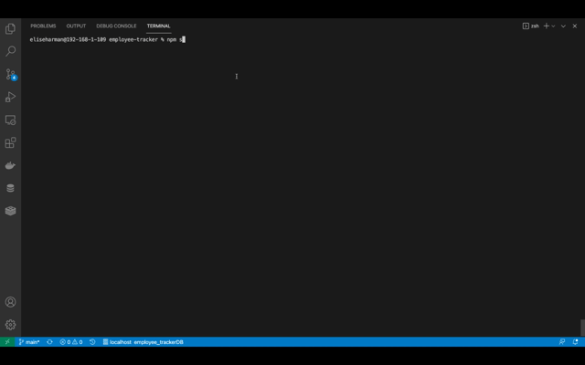

# MySQL: Employee Tracker

## Description

This application manages a company's employees. The command-line application allows users to:

- Add departments and employees

- View departments, roles, employees

  The following technologies were used to create this application

  - Node.JS
  - Inquirer
  - MySQL2

  ## Table of Contents

  - [Installation](#installation)
  - [Usage](#usage)
  - [Video Demonstration](#videoDemo)
  - [License](#license)
  - [Resources](#resources)
  - [Questions](#questions)

  ## Installation

  To install the application clone the repository from GitHub. Ensure you have the necessary dependencies of Inquirer and MySQL2 installed. Invoke the command `npm install` in your terminal.

  ## Usage

  To run the application, navigate to the server.js file in the command line and invoke the command `npm start` in your terminal.

  ## Video Demonstration

[Video demonstration link](https://youtu.be/QD5sV7c6r74)

## License

[MIT](https://choosealicense.com/licenses/mit/)

Copyright (c) 2021 Elise Harman

## Resources

[Foreign-Keys](https://dev.mysql.com/doc/refman/8.0/en/create-table-foreign-keys.html)

## Questions

If you have any questions or would like to report and issue please contact me at my [GitHub](https://github.com/harmane4) or elise_harman@hotmail.com
